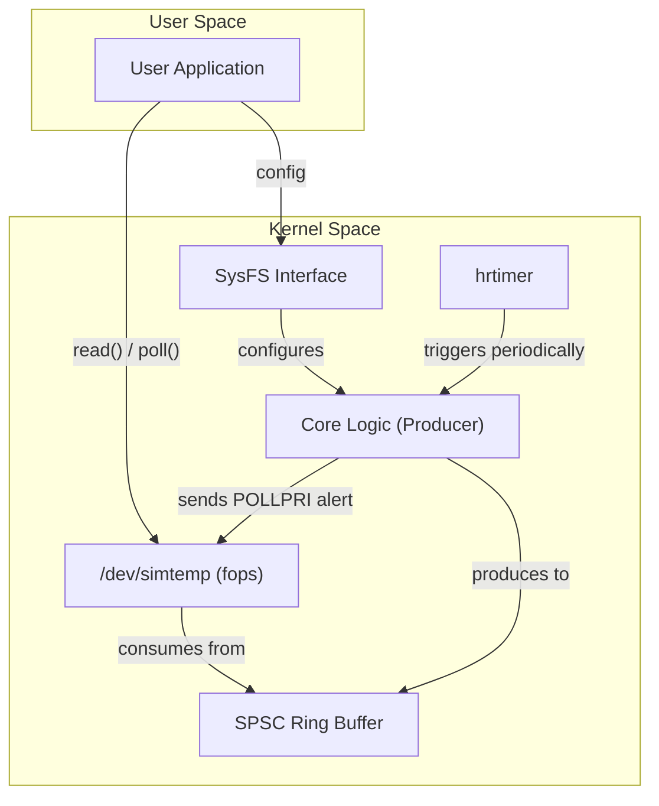
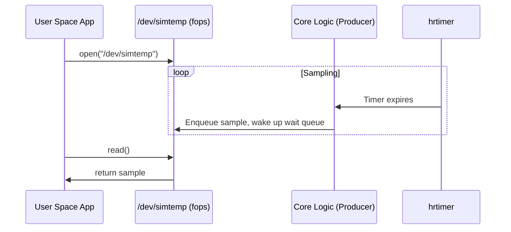
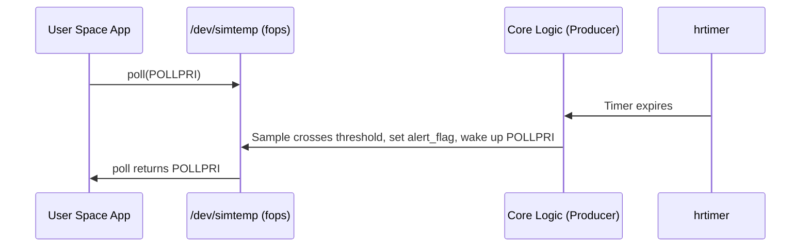

# Module Software Design (MSD)
## Sampler Data Collector (simtemp)

**License:** GPLv2  
**Author:** Fidel Eduardo Cabañas Castillo  
**Version:** Draft v0.1  
**Date:** 2025-10-05

---

> **Summary:**  
> This document details the software design for the "simtemp" Linux kernel module, which simulates periodic temperature sampling for embedded systems. It exposes data via `/dev/simtemp`, supports asynchronous I/O, and is configurable at runtime through SysFS.

---

## Table of Contents

1. [Introduction and Purpose](#1-introduction-and-purpose)
2. [Functional Requirements Overview](#2-functional-requirements-overview)
3. [Core Design Overview](#3-core-design-overview)
4. [Software Module File Structure and Design Partitioning](#4-software-module-file-structure-and-design-partitioning)  
    4.1 [Source File Overview](#41-source-file-overview)  
    4.2 [File Tree Representation (Preliminary)](#42-file-tree-representation-preliminary)  
    4.3 [File-to-Requirement Traceability Matrix](#43-file-to-requirement-traceability-matrix)  
    4.4 [Rationale](#44-rationale)  
    4.5 [Interface & Data Contract (Design Freeze for MTS)](#45-interface--data-contract-design-freeze-for-mts)
5. [Licensing and Intellectual Property](#5-licensing-and-intellectual-property)
6. [Future Work (Next Design Iteration)](#6-future-work-next-design-iteration)
7. [Document History](#7-document-history)

---

# 1. Introduction and Purpose

This document specifies the detailed software design for the Sampler Data Collector (simtemp) Linux kernel module. The module implements a high-resolution Producer–Consumer sampling mechanism for embedded systems. It periodically produces temperature samples and exposes them to user space via `/dev/simtemp` (binary reads), supports asynchronous I/O via `poll()`/`epoll()`, and is configured through SysFS.

---

# 2. Functional Requirements Overview

**Table 1. Functional Requirements**

| ID        | Requirement Description                                                                 |
| :-------- | :-------------------------------------------------------------------------------------- |
| **FR-01** | **Sampling Frequency:** Support a minimum sampling frequency of 200 Hz (5 ms period).   |
| **FR-02** | **User Interface:** Expose a character device `/dev/simtemp` with binary read.          |
| **FR-03** | **Asynchronous Events:** Signal data ready via `POLLIN` and threshold crossing via `POLLPRI`. |
| **FR-04** | **Configuration Interface:** Provide SysFS attributes for `sampling_ms` and `threshold_mC`. |
| **FR-05** | **Synchronization & Buffering:** Use a ring buffer with overrun detection.              |
| **FR-06** | **Platform Integration:** Register as Platform Driver, DT compatible `compatible = "nxp,simtemp"`. |
| **FR-07** | **Licensing:** All sources comply with `GPLv2` with `SPDX` identifiers.                 |

---

# 3. Core Design Overview

A high-resolution **hrtimer** periodically generates samples (Producer) and enqueues them into a single-producer/single-consumer (SPSC) ring buffer. User space reads via `/dev/simtemp`. SysFS handles runtime configuration. **poll()/epoll()** notify:

- **POLLIN** when data is available,
- **POLLPRI** when the configured temperature threshold is crossed.

**High-level flow:**



---

# 3.1 Sequence Diagrams

### 3.1.1 Data Read Sequence



### 3.1.2 Threshold Alert Sequence




# 4. Software Module File Structure and Design Partitioning

All files are GPLv2, with SPDX at the top of each source:  
```c
// SPDX-License-Identifier: GPL-2.0
```

## 4.1 Source File Overview

**Table 2. Source Files and Responsibilities**

| Path                           | Primary Function         | Key Responsibilities                                                       | Priority |
| ------------------------------ | ------------------------ | -------------------------------------------------------------------------- | -------- |
| `driver/Kconfig`               | Build configuration      | `CONFIG_SIMTEMP` menu entry and help                                       | Must     |
| `driver/Makefile`              | Kbuild definition        | Multi-object module composition                                            | Must     |
| `driver/simtemp.c`             | Platform lifecycle       | probe/remove, DT parsing, resource allocation, miscdevice registration     | Must     |
| `driver/simtemp_core.c`        | Core Producer–Consumer   | hrtimer, sample generation, threshold detection, wakeups                   | Must     |
| `driver/simtemp_ringbuf.c`     | Buffer management        | Lockless SPSC ring buffer, overflow detection                              | Must     |
| `driver/simtemp_ringbuf.h`     | Buffer API               | Ring buffer declarations/helpers                                           | Must     |
| `driver/simtemp_fops.c`        | Character device I/O     | `/dev/simtemp` read/poll/ioctl                                             | Must     |
| `driver/simtemp_sysfs.c`       | Configuration            | SysFS attributes (`sampling_ms`, `threshold_mC`) with safe reprogramming   | Must     |
| `driver/simtemp_debugfs.c`     | Diagnostics              | Debugfs counters: `total_samples`, `buffer_overflows`, `alert_flag`        | Rec      |
| `driver/trace/simtemp_trace.h` | Tracepoints              | Optional ftrace hooks                                                      | Opt      |
| `include/uapi/linux/simtemp.h` | UAPI header              | `IOCTLs` and public structs                                                | Rec      |

---

## 4.2 File Tree Representation (Preliminary)

```
simtemp/
├── driver/
│   ├── Kconfig
│   ├── Makefile
│   ├── simtemp.c
│   ├── simtemp_core.c
│   ├── simtemp_ringbuf.c
│   ├── simtemp_ringbuf.h
│   ├── simtemp_fops.c
│   ├── simtemp_sysfs.c
│   ├── simtemp_debugfs.c
│   └── trace/simtemp_trace.h
│
├── include/uapi/linux/simtemp.h
├── dts/nxp,simtemp-overlay.dts
├── Documentation/
│   ├── ABI/testing/sysfs-driver-simtemp
│   └── devicetree/bindings/misc/nxp,simtemp.yaml
│
├── docs/
│   ├── MSD_simtemp.md
│   ├── Architecture.svg
│   └── README.md
├── scripts/ (build.sh, load.sh, unload.sh, set_sampling.sh)
├── tests/   (README.md, smoke_load_module.sh, test_poll_sysfs.py)
├── user/samples/simtemp_reader.py
├── docker/Dockerfile.dev
├── LICENSE
└── CHANGELOG.md
```

---

## 4.3 File-to-Requirement Traceability Matrix

**Table 3. Traceability Matrix**

| File / Component      | Related FRs  | Rationale                      |
| --------------------- | ------------ | ------------------------------ |
| `simtemp_core.c`      | FR-01, FR-05 | Periodic sampling + enqueue    |
| `simtemp_ringbuf.c`   | FR-05        | Thread-safe SPSC buffering     |
| `simtemp_fops.c`      | FR-02, FR-03 | Binary read + poll integration |
| `simtemp_sysfs.c`     | FR-04        | Runtime configuration          |
| `simtemp.c`           | FR-06        | Platform driver and DT         |
| `nxp,simtemp.yaml`    | FR-06        | Binding schema                 |
| `LICENSE`             | FR-07        | Licensing compliance           |

---

## 4.4 Rationale

- **Separation of concerns:** Clear division between I/O, configuration, timing, and buffering.
- **Maintainability & scalability:** Facilitates future features (tracepoints, calibration).
- **Traceability:** Direct mapping from requirements to files and interfaces, supporting MTS creation.

---

## 4.5 Interface & Data Contract (Design Freeze for MTS)

The following interface and data contracts are frozen for the MTS phase. Interface IDs (IF-*) and data structure IDs (DS-*) are stable references for tests.

### 4.5.1 Data Structures (UAPI & Kernel)

**DS-01 — struct simtemp_sample_v1 (UAPI / read() payload)**  
Stable ABI for user space.

```c
struct simtemp_sample_v1 {
    __s64 period_msec;          /* CLOCK_REALTIME milliseconds */
    __s64 temperature_mC;       /* e.g., 25000 = 25.0°C */
    __u16 status_flags;         /* 0 = OK */
} __attribute__((packed));
```

**DS-02 — struct simtemp_sample (Kernel / internal)**

```c
struct simtemp_sample {
    __u64 period_msec;     /* effective sampling period in ms at capture time */
    __u64 temperature_mC;  /* temperature in milli-Celsius (e.g., 25000 = 25.0°C) */
    __u64 status_flags;    /* bitfield: 0=OK, 1=Overflow, 2=Threshold crossed, ... */
} __attribute__((packed));
```

**DS-03 — struct simtemp_ring (Kernel / SPSC ring)**

```c
struct simtemp_ring {
    unsigned int size;
    atomic_t head;               /* producer (IRQ) */
    atomic_t tail;               /* consumer (fops) */
    struct simtemp_sample *buf;  /* vmalloc'ed */
};
```

**DS-04 — struct simtemp_dev (Kernel / global state)**

```c
struct simtemp_dev {
    struct platform_device *pdev;
    struct miscdevice      misc;
    struct hrtimer         timer;

    spinlock_t state_lock;    /* period and run-state protection */
    spinlock_t tail_lock;     /* dequeue protection */
    wait_queue_head_t data_wq;/* POLLIN */
    wait_queue_head_t thr_wq; /* POLLPRI */
    atomic_t alert_flag;      /* 0/1 */

    struct simtemp_ring rb;
    u32 period_us;
    u16 threshold_mC;
    atomic_t total_samples;
    atomic_t overflows;
    atomic_t is_running;      /* 0/1 */
};
```

**DS-05 — SysFS attributes**
- `sampling_ms` (RW, u32, 1..10000) — safely reprograms hrtimer
- `threshold_mC` (RW, u16) — sets alert threshold and resets `alert_flag`

**DS-06 — Device Tree properties**
- `compatible = "nxp,simtemp"` (required)
- `sample-period-us` (u32, recommended 1000..10,000,000)

---

### 4.5.2 UAPI (IOCTLs)

**IF-UAPI-01 — SIMTEMP_IOC_SET_STATE**  
_Signature:_ `_IOW('S', 0x01, __u32)`  
_Description:_ Sets the running state of the sensor simulation.  
_Arguments:_ `0` (STOP), `1` (START).  
_Errors:_  
- `-EINVAL`: Invalid argument (not 0 or 1).
- `-EIO`: Failed to start the simulation core.

**IF-UAPI-02 — SIMTEMP_IOC_GET_STATE**  
_Signature:_ `_IOR('S', 0x02, __u32)`  
_Description:_ Retrieves the current running state.  
_Returns:_ `0` (STOPPED) or `1` (RUNNING).

**poll() Contract**  
- Returns `POLLIN | POLLRDNORM` when new temperature data is available to be read.
- Returns `POLLPRI` when the temperature threshold has been crossed (`alert_flag == 1`).

---

### 4.5.3 File Operations (`/dev/simtemp`)

**IF-FOPS-01 — ssize_t simtemp_read(...)**  
_Reads simulated temperature data from the device buffer._  
- **Blocking:** Sleeps on `data_wq` if the buffer is empty. Can be interrupted by a signal (`-ERESTARTSYS`).
- **Non-blocking:** Returns `-EAGAIN` if the buffer is empty.
- **Errors:** `-EFAULT`, `-EINVAL`, `-ERESTARTSYS`.

**IF-FOPS-02 — __poll_t simtemp_poll(...)**  
_Waits for data or events on the device._  
- **Wait Queues:** Registers the caller on `data_wq` (for data) and `thr_wq` (for alerts).
- **Returns:** `POLLIN | POLLRDNORM` on new data; `POLLPRI` on an alert condition.

**IF-FOPS-03 — long simtemp_unlocked_ioctl(...)**  
_Dispatches IOCTL commands to the appropriate handlers (`IF-UAPI-01`, `IF-UAPI-02`)._

---

### 4.5.4 Core Timing & Control

**IF-CORE-01 — void simtemp_core_start(struct simtemp_dev *d)**  
_Starts the periodic temperature generation._  
- **Post-conditions:**
    - `is_running` is set to `1`.
    - The first timer expiration is scheduled to occur within `period_us`.

**IF-CORE-02 — void simtemp_core_stop(struct simtemp_dev *d)**  
_Stops the periodic temperature generation._  
- **Guarantees:** Ensures no timer callbacks are active or pending upon return (via `hrtimer_cancel`).

**IF-CORE-03 — enum hrtimer_restart simtemp_timer_cb(struct hrtimer *t)**  
_The HR timer callback function (Producer IRQ context)._  
- **Actions:**
    1. Generates a new temperature sample.
    2. Enqueues the sample into the data buffer.
    3. Wakes up any readers sleeping on `data_wq`.
    4. If the temperature crosses a threshold and the `alert_flag` toggles from `0` to `1`, it wakes up any pollers on `thr_wq`.
- **Rearm:** Uses `hrtimer_forward_now` to schedule the next periodic execution.

---

### 4.5.5 Ring Buffer API (SPSC)

**Table 4. Ring Buffer API**

| ID       | Function Signature                                                              | Returns / Notes      |
| :------- | :------------------------------------------------------------------------------ | :------------------- |
| IF-RB-01 | `int simtemp_rb_init(struct simtemp_ring *rb, unsigned int entries)`            | `-EINVAL`, `-ENOMEM` |
| IF-RB-02 | `void simtemp_rb_free(struct simtemp_ring *rb)`                                 |                      |
| IF-RB-03 | `bool simtemp_rb_is_empty(const struct simtemp_ring *rb)`                       |                      |
| IF-RB-04 | `bool simtemp_rb_is_full(const struct simtemp_ring *rb)`                        |                      |
| IF-RB-05 | `int simtemp_rb_enqueue(struct simtemp_ring *rb, const struct simtemp_sample *s)` | `-ENOSPC`            |
| IF-RB-06 | `int simtemp_rb_dequeue(struct simtemp_ring *rb, struct simtemp_sample *out)`   | `-EAGAIN`            |

---

### 4.5.6 SysFS API (internal)

**Table 5. SysFS API**

| ID          | Function Signature                               |
| :---------- | :----------------------------------------------- |
| IF-SYSFS-01 | `int simtemp_sysfs_create(struct simtemp_dev *d)`  |
| IF-SYSFS-02 | `void simtemp_sysfs_remove(struct simtemp_dev *d)` |

- **Reprogramming contract** (under `state_lock`): If the timer is running, the sequence is `hrtimer_cancel()` → update `period_us` → `hrtimer_start()`.
- Writing to `threshold_mC` resets `alert_flag` to `0`.

---

### 4.5.7 Platform Driver Lifecycle

**IF-PF-01 — int simtemp_probe(struct platform_device *pdev)**
- Parse `sample-period-us` from Device Tree.
- Initialize the ring buffer.
- Initialize the `hrtimer`.
- Register the `miscdevice`.
- Create SysFS interface.

**IF-PF-02 — int simtemp_remove(struct platform_device *pdev)**
- Stop core logic (`core_stop()`).
- Remove DebugFS and SysFS interfaces.
- Deregister the `miscdevice`.
- Free the ring buffer.

---

### 4.5.8 Debug & Trace (optional)

**Table 6. Debug & Trace API**

| ID        | Function Signature                             |
| :-------- | :--------------------------------------------- |
| IF-DBG-01 | `int simtemp_debugfs_init(struct simtemp_dev *d)`|
| IF-DBG-02 | `void simtemp_debugfs_remove(void)`             |

- **Suggested Tracepoints** (names reserved):
    - `trace_simtemp_enqueue()`
    - `trace_simtemp_overflow()`
    - `trace_simtemp_threshold_cross()`

---

# 5. Licensing and Intellectual Property

All components are licensed under **GPLv2**.

The SPDX identifier must be present in each source file:
```c
// SPDX-License-Identifier: GPL-2.0
```

---

# 6. Future Work (Next Design Iteration)

- Optional workqueue-based deferred processing.
- Tracepoints for latency/jitter profiling.
- SysFS extensions (e.g., buffer size, statistics reset).
- Automated test coverage metrics and CI integration.

---

# 7. Document History

| Version   | Date       | Description                                                        | Author     |
| --------- | ---------- | ------------------------------------------------------------------ | ---------- |
| 0.1       | 2025-09-29 | Initial draft                                                      | F. Cabañas |

---

> **Note:**  
> For definitions of technical terms and acronyms (e.g., SPSC, hrtimer, POLLIN), see the [Glossary](#glossary) in the project documentation.